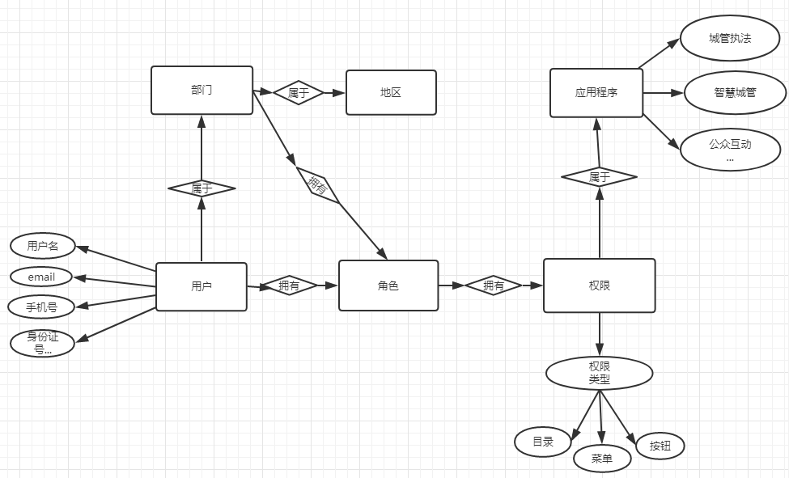
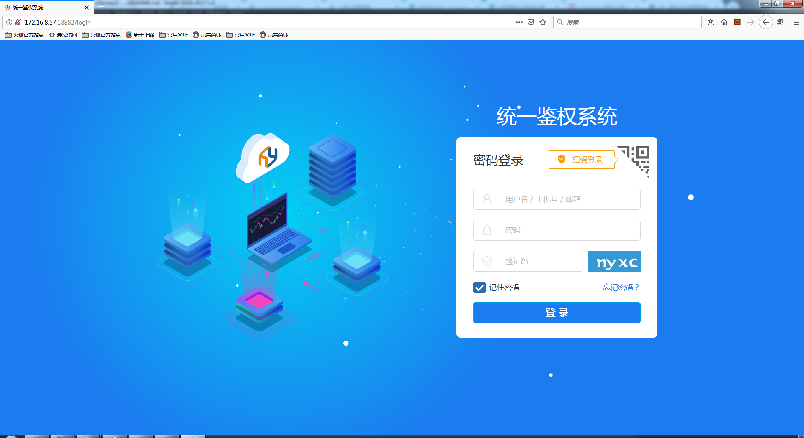
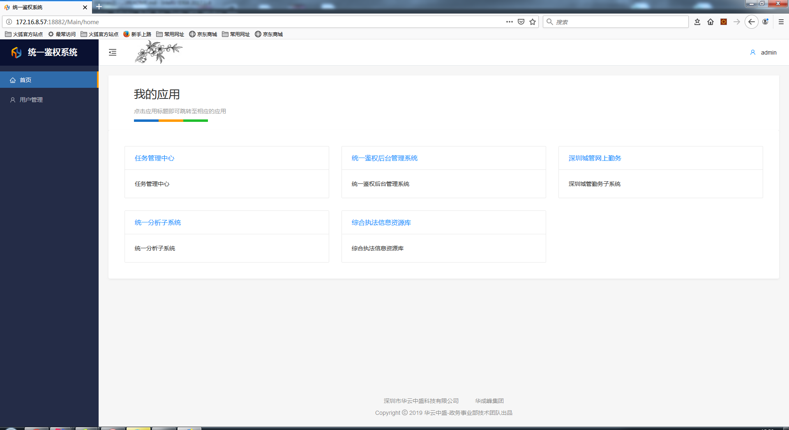
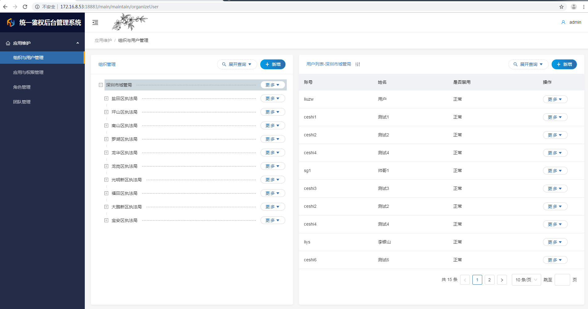
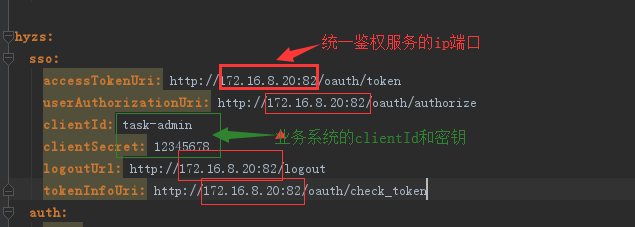
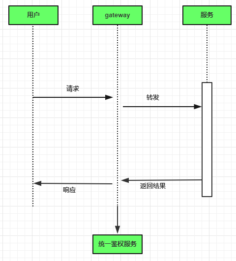

# tibmas2
# 统一鉴权服务+用户服务
## 1.原理
#### 1.1统一鉴权原理见api.md  
#### 1.2用户服务原理：
- 用户服务将用户、组织、角色、权限、应用进行统一管理，接入统一鉴权服务的各个业务系统共用同一套用户体系  
用户服务为各业务系统提供用户服务。  
用户服务ER图


## 2.用法
#### 2.1统一鉴权后台提供鉴权服务，前台提供授权登录页面

登录后可看到所拥有权限的应用，可进行快速进入系统

#### 2.2用户服务用法
- 用户中心分为组织与用户管理、应用与权限管理、角色管理、团队管理

## 3.部署
#### 3.1统一鉴权服务：  
后台：tibmas2-oauth-server.jar &nbsp;&nbsp;前台：tibmas-web-oauth  
注：tibmas-web-oauth需单独部署在一台服务器
#### 3.2用户服务
后台：tibmas2-webapi.jar &nbsp;&nbsp;前台：tibmas2-web-admin
#### 3.3getaway统一网关配置

```
wind:
  sso:
    accessTokenUri: http://172.16.8.20:82/oauth/token
    userAuthorizationUri: http://172.16.8.20:82/oauth/authorize
    clientId: task-admin
    clientSecret: 12345678
    logoutUrl: http://172.16.8.20:82/logout
    tokenInfoUri: http://172.16.8.20:82/oauth/check_token
```
流程图  

说明
- 用户请求后台都会统一经过gateway
- 当用户请求用户信息时，如果用户用户为空未登录，gateway则会将请求重定向到统一鉴权，  
通过统一鉴权获取授权码，再通过授权码获取token，再通过token获取用户信息，将用户信息  
和token放在session中。  
- 当用户请求后台服务资源时，gateway的过滤器会拦截请求，并验证token信息，如果验证通过  
则将请求转发到对应服务，后台服务处理请求并返回结果。如果验证不通过则证明用户未登录，  
用户需要进行登录。