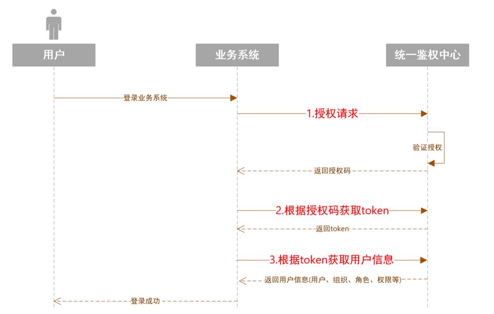
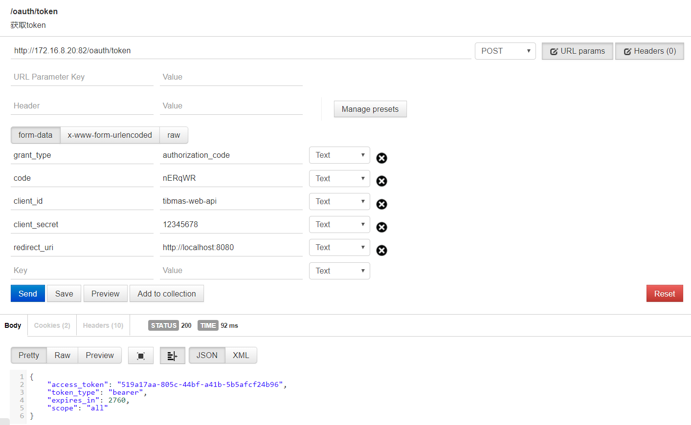
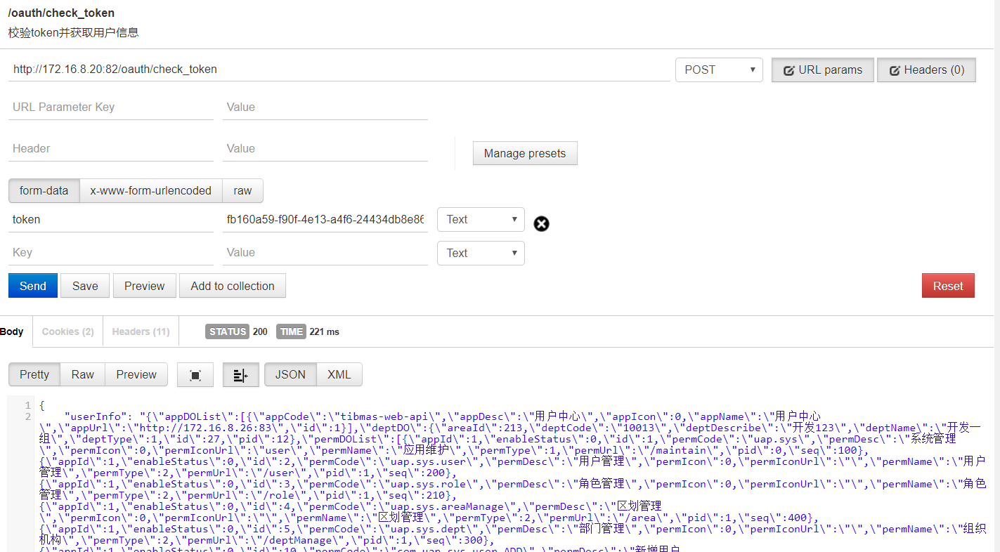

#单点登录
##主要流程

##流程说明
- 用户进入业务系统的登录页
- 业务系统向统一鉴权中心请求授权(将用户浏览器的地址重定向到统一鉴权中心授权地址)
- 用户在统一鉴权中心完成登录之后，生成授权码并以url参数的方式返回给业务系统
- 业务系统根据授权码获取token
- 业务系统根据token获取用户信息，此时建议业务系统将用户信息缓存在http session中
- 业务反馈登录成功的信息给用户
**_注意：业务系统与统一鉴权中心主要有三个接口，流程图标红部分，接下来会对这三个接口做详细描述_**

##授权请求

业务系统将用户的浏览器地址重定向到统一鉴权中心的授权页面，示例如下：

```shell
http://172.16.8.20:82/oauth/authorize?client_id=tibmas-web-api&redirect_uri=http://www.myhost.com/sso&response_type=code&state=8BHryi
```

其中http://172.16.8.20:82/oauth/authorize为统一鉴权中心的授权地址,其他参数说明如下：

参数|是否必填|说明
---|---|---
response_type|必填|固定值:"code"
client_id|必填|业务系统在统一鉴权中心的唯一标识，由统一鉴权中心分配给业务系统，分配之后将不会再修改
redirect_uri|必填|用户在统一鉴权中心登录成功后利用该地址携带授权码返回给业务系统，如：填写的值为http://www.myhost.com/sso 用户在统一鉴权中心完成登录授权后，统一鉴权中心会将用户浏览器地址重定向为:http://www.myhost.com/sso?code=12397&state=8BHryi 其中code为授权码，业务系统后续需要利用该授权获取token
state|必填|该参数是为了保证业务系统与统一鉴权中心交互的安全性设定的，由业务系统生成，建议4到8位的随机数，统一鉴权中心会在redirect_uri携带该参数，如果业务发现redirect_uri中该参数的值与之前生成的值不一致业务系统应该抛出异常，因为此时很有可能受到了网络安全的攻击

##根据授权码获取token
用户在统一鉴权中心完成登录授权之后，统一鉴权中心会将浏览器地址重定向到redirect_uri将携带授权码，如:
```shell
http://www.myhost.com/sso?code=12397&state=8BHryi 
```
业务系统在校验state值的合法性后，利用code的值通过统一鉴权中心的接口获取token,接口调用说明如下：


- http://172.16.8.20:82/oauth/token 为统一鉴权中心提供的接口地址
- 必须以post方式发送请求
- 请求参数如下：
参数|是否必填|说明
---|---|---
grant_type|必填|固定值:"authorization_code"
code|必填|redirect_uri中携带的code参数值
client_id|必填|与授权请求参数中的client_id字段保持一致
client_secret|必填|访问密钥，由统一鉴权中心分配，业务系统应该对该值进行保密
redirect_uri|必填|与授权请求参数中的redirect_uri字段保持一致
- 该接口以json的格式返回:
```json
{
    "access_token": "519a17aa-805c-44bf-a41b-5b5afcf24b96",
    "token_type": "bearer",
    "expires_in": 2760,
    "scope": "all"
}
```
字段说明如下:
参数|是否必填|说明
---|---|---
access_token|必填|token值，做为业务系统与统一鉴权中心的交互凭证
token_type|必填|固定值："bearer"
expires_in|必填|有效期,单位:秒
scope|必填|固定值:"all"
##根据token获取用户信息
接口调用说明：


- http://172.16.8.20:82/oauth/check_token 为接口地址
- 必须以post方式发送请求
- 请求参数如下：
参数|是否必填|说明
---|---|---
token|必填|上一步取得的token
- 该接口以json格式返回:
```json
{
    "userInfo": "{\"appDOList\":[{\"appCode\":\"tibmas-web-api\",\"appDesc\":\"用户中心\",\"appIcon\":0,\"appName\":\"用户中心\",\"appUrl\":\"http://172.16.8.26:83\",\"id\":1}],\"deptDO\":{\"areaId\":213,\"deptCode\":\"10013\",\"deptDescribe\":\"开发123\",\"deptName\":\"开发一组\",\"deptType\":1,\"id\":27,\"pid\":12},\"permDOList\":[{\"appId\":1,\"enableStatus\":0,\"id\":1,\"permCode\":\"uap.sys\",\"permDesc\":\"系统管理\",\"permIcon\":0,\"permIconUrl\":\"user\",\"permName\":\"应用维护\",\"permType\":1,\"permUrl\":\"/maintain\",\"pid\":0,\"seq\":100},{\"appId\":1,\"enableStatus\":0,\"id\":2,\"permCode\":\"uap.sys.user\",\"permDesc\":\"用户管理\",\"permIcon\":0,\"permIconUrl\":\"\",\"permName\":\"用户管理\",\"permType\":2,\"permUrl\":\"/user\",\"pid\":1,\"seq\":200},{\"appId\":1,\"enableStatus\":0,\"id\":3,\"permCode\":\"uap.sys.role\",\"permDesc\":\"角色管理\",\"permIcon\":0,\"permIconUrl\":\"\",\"permName\":\"角色管理\",\"permType\":2,\"permUrl\":\"/role\",\"pid\":1,\"seq\":210},{\"appId\":1,\"enableStatus\":0,\"id\":4,\"permCode\":\"uap.sys.areaManage\",\"permDesc\":\"区划管理\",\"permIcon\":0,\"permIconUrl\":\"\",\"permName\":\"区划管理\",\"permType\":2,\"permUrl\":\"/area\",\"pid\":1,\"seq\":400},{\"appId\":1,\"enableStatus\":0,\"id\":5,\"permCode\":\"uap.sys.dept\",\"permDesc\":\"部门管理\",\"permIcon\":0,\"permIconUrl\":\"\",\"permName\":\"组织机构\",\"permType\":2,\"permUrl\":\"/deptManage\",\"pid\":1,\"seq\":300},{\"appId\":1,\"enableStatus\":0,\"id\":10,\"permCode\":\"com.uap.sys.user.ADD\",\"permDesc\":\"新增用户\",\"permIcon\":0,\"permIconUrl\":\"\",\"permName\":\"新增用户\",\"permType\":3,\"permUrl\":\"/api/user/insert\",\"pid\":2,\"seq\":1000},{\"appId\":1,\"enableStatus\":0,\"id\":11,\"permCode\":\"com.uap.sys.user.UPDATE\",\"permDesc\":\"修改用户\",\"permIcon\":0,\"permIconUrl\":\"\",\"permName\":\"修改用户\",\"permType\":3,\"permUrl\":\"/api/user/update\",\"pid\":2,\"seq\":1100},{\"appId\":1,\"enableStatus\":0,\"id\":12,\"permCode\":\"com.uap.sys.user.DELETE\",\"permDesc\":\"删除用户\",\"permIcon\":0,\"permIconUrl\":\"\",\"permName\":\"删除用户\",\"permType\":3,\"permUrl\":\"/api/user/delete\",\"pid\":2,\"seq\":1200},{\"appId\":1,\"enableStatus\":0,\"id\":13,\"permCode\":\"com.uap.sys.user.LIST\",\"permDesc\":\"查询用户\",\"permIcon\":0,\"permIconUrl\":\"\",\"permName\":\"查询用户\",\"permType\":3,\"permUrl\":\"/api/user/list\",\"pid\":2,\"seq\":1300},{\"appId\":1,\"enableStatus\":0,\"id\":20,\"permCode\":\"uap.app\",\"permDesc\":\"应用管理*\",\"permIcon\":0,\"permIconUrl\":\"\",\"permName\":\"应用管理\",\"permType\":2,\"permUrl\":\"/app\",\"pid\":1,\"seq\":2000},{\"appId\":1,\"enableStatus\":0,\"id\":25,\"permCode\":\"perm\",\"permDesc\":\"权限管理\",\"permIcon\":0,\"permIconUrl\":\"\",\"permName\":\"菜单管理\",\"permType\":2,\"permUrl\":\"/perm\",\"pid\":1,\"seq\":2100}],\"permTreeVOS\":[{\"children\":[{\"children\":[],\"enableStatus\":0,\"id\":2,\"permCode\":\"uap.sys.user\",\"permDesc\":\"用户管理\",\"permIcon\":0,\"permIconUrl\":\"\",\"permName\":\"用户管理\",\"permType\":2,\"permUrl\":\"/user\",\"pid\":1,\"seq\":200},{\"children\":[],\"enableStatus\":0,\"id\":3,\"permCode\":\"uap.sys.role\",\"permDesc\":\"角色管理\",\"permIcon\":0,\"permIconUrl\":\"\",\"permName\":\"角色管理\",\"permType\":2,\"permUrl\":\"/role\",\"pid\":1,\"seq\":210},{\"children\":[],\"enableStatus\":0,\"id\":5,\"permCode\":\"uap.sys.dept\",\"permDesc\":\"部门管理\",\"permIcon\":0,\"permIconUrl\":\"\",\"permName\":\"组织机构\",\"permType\":2,\"permUrl\":\"/deptManage\",\"pid\":1,\"seq\":300},{\"children\":[],\"enableStatus\":0,\"id\":4,\"permCode\":\"uap.sys.areaManage\",\"permDesc\":\"区划管理\",\"permIcon\":0,\"permIconUrl\":\"\",\"permName\":\"区划管理\",\"permType\":2,\"permUrl\":\"/area\",\"pid\":1,\"seq\":400},{\"children\":[],\"enableStatus\":0,\"id\":20,\"permCode\":\"uap.app\",\"permDesc\":\"应用管理*\",\"permIcon\":0,\"permIconUrl\":\"\",\"permName\":\"应用管理\",\"permType\":2,\"permUrl\":\"/app\",\"pid\":1,\"seq\":2000},{\"children\":[],\"enableStatus\":0,\"id\":25,\"permCode\":\"perm\",\"permDesc\":\"权限管理\",\"permIcon\":0,\"permIconUrl\":\"\",\"permName\":\"菜单管理\",\"permType\":2,\"permUrl\":\"/perm\",\"pid\":1,\"seq\":2100}],\"enableStatus\":0,\"id\":1,\"permCode\":\"uap.sys\",\"permDesc\":\"系统管理\",\"permIcon\":0,\"permIconUrl\":\"user\",\"permName\":\"应用维护\",\"permType\":1,\"permUrl\":\"/maintain\",\"pid\":0,\"seq\":100}],\"roleDOList\":[{\"id\":1,\"roleCode\":\"SYS_ADMIN\",\"roleDesc\":\"系统管理员角色\",\"roleName\":\"管理员角色\",\"roleType\":1,\"roleTypeId\":1},{\"id\":3,\"roleCode\":\"100002\",\"roleDesc\":\"监督中心受理员角色\",\"roleName\":\"受理员\",\"roleType\":1,\"roleTypeId\":1},{\"id\":81,\"roleCode\":\"100003\",\"roleDesc\":\"监督中心值班长123\",\"roleName\":\"值班长\",\"roleType\":3},{\"id\":82,\"roleCode\":\"100001\",\"roleDesc\":\"采集员角色所用\",\"roleName\":\"采集员\",\"roleType\":2},{\"id\":83,\"roleCode\":\"200001\",\"roleDesc\":\"指挥中心派遣员\",\"roleName\":\"派遣员\",\"roleType\":2},{\"id\":86,\"roleCode\":\"300003\",\"roleDesc\":\"一级处置部门人员\",\"roleName\":\"一级处置员\",\"roleType\":2},{\"id\":87,\"roleCode\":\"300004\",\"roleDesc\":\"二级处置部门人员12\",\"roleName\":\"二级处置员\",\"roleType\":2},{\"id\":82,\"roleCode\":\"100001\",\"roleDesc\":\"采集员角色所用\",\"roleName\":\"采集员\",\"roleType\":2}],\"userDO\":{\"birthday\":1521103659000,\"deptId\":27,\"email\":\"admin@hua-cloud.com.cn\",\"enabled\":0,\"expired\":0,\"gender\":1,\"id\":1,\"idCardNo\":\" \",\"job\":\" \",\"locked\":0,\"mobileNo\":\"18171899874\",\"updatePasswordTime\":1546590630000,\"userAccount\":\"admin\",\"userName\":\"admin\",\"userPhoto\":1}}",
    "exp": 1546681728,
    "user_name": "admin",
    "authorities": [
        "uap.sys.dept",
        "uap.sys.user",
        "com.uap.sys.user.ADD",
        "uap.sys",
        "perm",
        "com.uap.sys.user.LIST",
        "com.uap.sys.user.UPDATE",
        "com.uap.sys.user.DELETE",
        "uap.sys.areaManage",
        "uap.app",
        "uap.sys.role"
    ],
    "client_id": "tibmas-web-api",
    "scope": [
        "all"
    ],
    "active": true
}
```
主要的字段为userInfo,其为一个json格式的字符串，内容示例如下：
```json
{
	"appDOList": [{
		"appCode": "tibmas-web-api",
		"appDesc": "用户中心",
		"appIcon": 0,
		"appName": "用户中心",
		"appUrl": "http://172.16.8.26:83",
		"id": 1
	}],
	"deptDO": {
		"areaId": 213,
		"deptCode": "10013",
		"deptDescribe": "开发123",
		"deptName": "开发一组",
		"deptType": 1,
		"id": 27,
		"pid": 12
	},
	"permDOList": [{
		"appId": 1,
		"enableStatus": 0,
		"id": 1,
		"permCode": "uap.sys",
		"permDesc": "系统管理",
		"permIcon": 0,
		"permIconUrl": "user",
		"permName": "应用维护",
		"permType": 1,
		"permUrl": "/maintain",
		"pid": 0,
		"seq": 100
	}, {
		"appId": 1,
		"enableStatus": 0,
		"id": 2,
		"permCode": "uap.sys.user",
		"permDesc": "用户管理",
		"permIcon": 0,
		"permIconUrl": "",
		"permName": "用户管理",
		"permType": 2,
		"permUrl": "/user",
		"pid": 1,
		"seq": 200
	}, {
		"appId": 1,
		"enableStatus": 0,
		"id": 3,
		"permCode": "uap.sys.role",
		"permDesc": "角色管理",
		"permIcon": 0,
		"permIconUrl": "",
		"permName": "角色管理",
		"permType": 2,
		"permUrl": "/role",
		"pid": 1,
		"seq": 210
	}, {
		"appId": 1,
		"enableStatus": 0,
		"id": 4,
		"permCode": "uap.sys.areaManage",
		"permDesc": "区划管理",
		"permIcon": 0,
		"permIconUrl": "",
		"permName": "区划管理",
		"permType": 2,
		"permUrl": "/area",
		"pid": 1,
		"seq": 400
	}, {
		"appId": 1,
		"enableStatus": 0,
		"id": 5,
		"permCode": "uap.sys.dept",
		"permDesc": "部门管理",
		"permIcon": 0,
		"permIconUrl": "",
		"permName": "组织机构",
		"permType": 2,
		"permUrl": "/deptManage",
		"pid": 1,
		"seq": 300
	}, {
		"appId": 1,
		"enableStatus": 0,
		"id": 10,
		"permCode": "com.uap.sys.user.ADD",
		"permDesc": "新增用户",
		"permIcon": 0,
		"permIconUrl": "",
		"permName": "新增用户",
		"permType": 3,
		"permUrl": "/api/user/insert",
		"pid": 2,
		"seq": 1000
	}, {
		"appId": 1,
		"enableStatus": 0,
		"id": 11,
		"permCode": "com.uap.sys.user.UPDATE",
		"permDesc": "修改用户",
		"permIcon": 0,
		"permIconUrl": "",
		"permName": "修改用户",
		"permType": 3,
		"permUrl": "/api/user/update",
		"pid": 2,
		"seq": 1100
	}, {
		"appId": 1,
		"enableStatus": 0,
		"id": 12,
		"permCode": "com.uap.sys.user.DELETE",
		"permDesc": "删除用户",
		"permIcon": 0,
		"permIconUrl": "",
		"permName": "删除用户",
		"permType": 3,
		"permUrl": "/api/user/delete",
		"pid": 2,
		"seq": 1200
	}, {
		"appId": 1,
		"enableStatus": 0,
		"id": 13,
		"permCode": "com.uap.sys.user.LIST",
		"permDesc": "查询用户",
		"permIcon": 0,
		"permIconUrl": "",
		"permName": "查询用户",
		"permType": 3,
		"permUrl": "/api/user/list",
		"pid": 2,
		"seq": 1300
	}, {
		"appId": 1,
		"enableStatus": 0,
		"id": 20,
		"permCode": "uap.app",
		"permDesc": "应用管理*",
		"permIcon": 0,
		"permIconUrl": "",
		"permName": "应用管理",
		"permType": 2,
		"permUrl": "/app",
		"pid": 1,
		"seq": 2000
	}, {
		"appId": 1,
		"enableStatus": 0,
		"id": 25,
		"permCode": "perm",
		"permDesc": "权限管理",
		"permIcon": 0,
		"permIconUrl": "",
		"permName": "菜单管理",
		"permType": 2,
		"permUrl": "/perm",
		"pid": 1,
		"seq": 2100
	}],
	"permTreeVOS": [{
		"children": [{
			"children": [],
			"enableStatus": 0,
			"id": 2,
			"permCode": "uap.sys.user",
			"permDesc": "用户管理",
			"permIcon": 0,
			"permIconUrl": "",
			"permName": "用户管理",
			"permType": 2,
			"permUrl": "/user",
			"pid": 1,
			"seq": 200
		}, {
			"children": [],
			"enableStatus": 0,
			"id": 3,
			"permCode": "uap.sys.role",
			"permDesc": "角色管理",
			"permIcon": 0,
			"permIconUrl": "",
			"permName": "角色管理",
			"permType": 2,
			"permUrl": "/role",
			"pid": 1,
			"seq": 210
		}, {
			"children": [],
			"enableStatus": 0,
			"id": 5,
			"permCode": "uap.sys.dept",
			"permDesc": "部门管理",
			"permIcon": 0,
			"permIconUrl": "",
			"permName": "组织机构",
			"permType": 2,
			"permUrl": "/deptManage",
			"pid": 1,
			"seq": 300
		}, {
			"children": [],
			"enableStatus": 0,
			"id": 4,
			"permCode": "uap.sys.areaManage",
			"permDesc": "区划管理",
			"permIcon": 0,
			"permIconUrl": "",
			"permName": "区划管理",
			"permType": 2,
			"permUrl": "/area",
			"pid": 1,
			"seq": 400
		}, {
			"children": [],
			"enableStatus": 0,
			"id": 20,
			"permCode": "uap.app",
			"permDesc": "应用管理*",
			"permIcon": 0,
			"permIconUrl": "",
			"permName": "应用管理",
			"permType": 2,
			"permUrl": "/app",
			"pid": 1,
			"seq": 2000
		}, {
			"children": [],
			"enableStatus": 0,
			"id": 25,
			"permCode": "perm",
			"permDesc": "权限管理",
			"permIcon": 0,
			"permIconUrl": "",
			"permName": "菜单管理",
			"permType": 2,
			"permUrl": "/perm",
			"pid": 1,
			"seq": 2100
		}],
		"enableStatus": 0,
		"id": 1,
		"permCode": "uap.sys",
		"permDesc": "系统管理",
		"permIcon": 0,
		"permIconUrl": "user",
		"permName": "应用维护",
		"permType": 1,
		"permUrl": "/maintain",
		"pid": 0,
		"seq": 100
	}],
	"roleDOList": [{
		"id": 1,
		"roleCode": "SYS_ADMIN",
		"roleDesc": "系统管理员角色",
		"roleName": "管理员角色",
		"roleType": 1,
		"roleTypeId": 1
	}, {
		"id": 3,
		"roleCode": "100002",
		"roleDesc": "监督中心受理员角色",
		"roleName": "受理员",
		"roleType": 1,
		"roleTypeId": 1
	}, {
		"id": 81,
		"roleCode": "100003",
		"roleDesc": "监督中心值班长123",
		"roleName": "值班长",
		"roleType": 3
	}, {
		"id": 82,
		"roleCode": "100001",
		"roleDesc": "采集员角色所用",
		"roleName": "采集员",
		"roleType": 2
	}, {
		"id": 83,
		"roleCode": "200001",
		"roleDesc": "指挥中心派遣员",
		"roleName": "派遣员",
		"roleType": 2
	}, {
		"id": 86,
		"roleCode": "300003",
		"roleDesc": "一级处置部门人员",
		"roleName": "一级处置员",
		"roleType": 2
	}, {
		"id": 87,
		"roleCode": "300004",
		"roleDesc": "二级处置部门人员12",
		"roleName": "二级处置员",
		"roleType": 2
	}, {
		"id": 82,
		"roleCode": "100001",
		"roleDesc": "采集员角色所用",
		"roleName": "采集员",
		"roleType": 2
	}],
	"userDO": {
		"birthday": 1521103659000,
		"deptId": 27,
		"email": "admin@hua-cloud.com.cn",
		"enabled": 0,
		"expired": 0,
		"gender": 1,
		"id": 1,
		"idCardNo": " ",
		"job": " ",
		"locked": 0,
		"mobileNo": "18171899874",
		"updatePasswordTime": 1546590630000,
		"userAccount": "admin",
		"userName": "admin",
		"userPhoto": 1
	}
}
```
重要字段说明：
字段名称|类型|长度|说明
---|---|---|---
userDO|Object||用户信息
--userDO.id|int||用户ID，注意：日志审计时需要填入该字段
--userDO.userAccount|String|50|用户账号
--userDO.userName|String|50|用户名称
--userDO.email|String|50|邮箱
--userDO.mobileNo|String|30|手机
deptDO|Object||用户对应的组织，一个用户有且只有一个组织
--deptDO.id|int||组织ID，注意：日志审计时需要填入该字段
--deptDO.deptCode|String|20|组织编码
--deptDO.deptName|String|200|组织名称
roleDOList|Array||用户对应的角色，一个用户可以有多个角色
--roleDOList.roleCode|String|100|角色编码
--roleDOList.roleName|String|200|角色名称
permDOList|Array||应用对应的权限
--permDOList.permCode|String|100|权限编码
--permDOList.permName|String|20|权限名称
--permDOList.permType|Int||权限类型:1-目录;2-菜单;3-操作(可用做按钮或其他的权限)
permTreeVOS|Array||应用对应的菜单，树状,数据来源permDOList,过滤掉permType为3的记录，并以树状结构返回，业务系统可以利用该数据渲染菜单 
--permTreeVOS.permCode|String|100|菜单编码
--permTreeVOS.permName|String|20|菜单名称
--permTreeVOS.permIconUrl|String|200|菜单图标地址
--permTreeVOS.permUrl|String|200|菜单对应的地址
----permTreeVOS.children|Object||子菜单
appDOList|Array||业务系统应用信息，注意该数组里只会有一个对象
--appDOList.id|int||应用ID,注意：日志审计时需要填入该字段

#日志审计
业务系统需要将主要的业务日志同步到统一鉴权中心,主要的字段如下：
序号|字段名称|类型|长度|是否必填|说明
---|---|---|---|---|---
1|appId|int||必填|应用的id，用户信息里获取该字段
2|deptId|int||必填|用户对应的组织id,用户信息里获取该字段
3|userId|int||必填|用户Id，用户信息里获取该字段
4|mainModel|String|200|必填|用户操作了应用的模块
5|subModel |String|200|选填|二级模块
6|optrTarget |String|200|必填|用户操作的对象
7|optrDesc |String|400|选填|操作说明
8|optrTime|String|30|必填|操作时间:yyyy-MM-dd HH24-mi-ss
示例如下：
```json
{
  "appId": 1,
  "deptId": 1,
  "mainModel": "用户管理模块",
  "optrDesc": "修改了用户[李四]的详情信息",
  "optrTarget": "李四",
  "optrTime": "2019-01-05 10:39:36",
  "subModel": "修改用户信息",
  "userId": 5
}
```
统一鉴权中心提供两种方法进行日志同步（业务系统可以任选一种）
- http接口方式
- ftp文件方式

##http接口日志同步
请求示例：
```shell
curl -X POST --header 'Content-Type: application/json' --header 'Accept: application/json' -d '[ \ 
 { \ 
   "appId": 1, \ 
   "deptId": 1, \ 
   "mainModel": "用户管理模块", \ 
   "optrDesc": "修改了用户[李四]的详情信息", \ 
   "optrTarget": "李四", \ 
   "optrTime": "2019-01-05 10:39:36", \ 
   "subModel": "修改用户信息", \ 
   "userId": 5 \ 
 } \ 
 ]' 'http://localhost:11135/webapi/optrlog/insertOptrLogList'
```
请求体为一个数组，可以传入多条记录，但不能超过1000条
返回示例:
```json
{
  "code": 0,#code为0成功，其他失败
  "msg": "TradeOK",
  "data": true
}
```
##ftp文件方式同步
业务系统需要一次生成两种文件并上传到指定的ftp主机上
第一种文件为数据文件：
文件名格式：optrlog__{clientId}_{createTime}_{num}.data
-  clientId：统一鉴权分配

- createTime: 文件时间，格式：yyyyMMddHH24miss

- num:序列号,数字

文件中每一行为一条日志记录,即记录分隔符为回车换行
字段与字段之间用ascii码为01的不可见字符分隔，字段顺序如下：
序号|字段名称|类型|长度|是否必填|说明
---|---|---|---|---|---
1|appId|int||必填|应用的id，用户信息里获取该字段
2|deptId|int||必填|用户对应的组织id,用户信息里获取该字段
3|userId|int||必填|用户Id，用户信息里获取该字段
4|mainModel|String|200|必填|用户操作了应用的模块
5|subModel |String|200|选填|二级模块
6|optrTarget |String|200|必填|用户操作的对象
7|optrDesc |String|400|选填|操作说明
8|optrTime|String|30|必填|操作时间:yyyy-MM-dd HH24-mi-ss

第二种文件为控制文件
文件名格式：optrlog__{clientId}_{createTime}_{num}.ctl，跟数据文件名仅仅是后缀不一样
文件内容为空，业务系统需要保证数据文件上传成功后再上传控制文件
